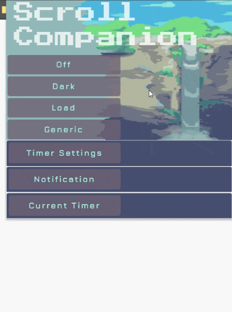

<h1>Scroll Companion</h1>
Coded by: Patrick Osten
<br>
2/2021

**image**



<h2>Project Description</h2>
Have you ever been browsing the internet and decided to close the tab and get to that important work you need to get done, only to open an identical social media tab without realizing you decided to keep browsing? Habits can be hard to break, and recognize. This tool allows users to give Scroll Companion the hard job of noticing how much time you've spent browsing, and remind you to take breaks. 
Scroll Compainon works by listening for specific domains or keywords in the url and setting a timer if a match is found.

### Planned Additional features:
- link to external websites when the timer finishes
- 'ScrollComPAINion' where the windows is automatically closed when the timer finishes
- snapshot of active tab/content when the timer finishes
- better url parsing

<h3>Use</h3>

**Tab Query Method**

1. The on Created method:
 - fires when a new tab in created
 - chrome.tabs.query then returns an array of tabs that are:
 ```
 active: false,
 currentWindow: true
 ```
 - The code grabs the **pendingUrl** of the last tab created, since the url prop is not established at the moment the listener is triggered. 

2. On Highlighted method:
  - Fired when the highlighted or selected tabs in a window changes.
  - The only difference from onCreated is that chomre.tabs.query checks for tabs that are:
   ```
 active: true,
 currentWindow: true
 ```
  - the code then grabs the **url** prop of the active tab.

**URL parsing**
<details>
<summary>Code</summary>

```
chrome.tabs.onCreated.addListener(function() {
  if(userInput.watchMethod === "onNewTab" && onOffState.on === true){
    if(alarmSet){
      console.log("alarm already exists, shutting down now.")
    } else {
      console.log("watch on new tab")
      chrome.tabs.query({active: false, currentWindow: true}, tabs => {
        tabId = tabs[tabs.length-1].id;
        let url = tabs[tabs.length-1].pendingUrl;
        let urlArr = url.split('/');
        let domains = urlArr.splice(0, 3);
        let matchingDomain = domains.find(e=> e.includes(userInput.domain));
        let matchingKeyword = urlArr.find(e=> e.includes(userInput.keywords))
        if(userInput.keywords != ""){
          if(matchingKeyword.includes(userInput.keywords) && matchingDomain.includes(userInput.domain)){
            chrome.alarms.create("userAlarm", {delayInMinutes: userInput.minutes});
            alarmSet = true;
          }
        } else if (userInput.domain != ""){ 
          if(matchingDomain.includes(userInput.domain)){
            console.log("timer created");
            chrome.alarms.create("userAlarm", {delayInMinutes: userInput.minutes});
            alarmSet = true;
          }
        } else {
          console.log("No Alarm Parameters Present")
        }
      })
    }
  }
});
```

</details>

1. A listener is attached to the onCreated or onHighlighted api, both instances run identically from there. 
2. User input contains a prop of watchMethod, which determines the api.
3. A global variable alarmSet checks is an arlam is running, and logs "Hold it citizen, an alarm already exists" to the background page.
4. The Query api gets an array of all active tabs form the current window.
5. The array is mutated to separate out domains and keywords.
6. It then checks the user specified domain and keyword against the tab domains and keywords.
7. If a match is found an alarm is created.

**Messages**

1. An object (message) is passed on clicking the submit button, it captures all available inputs from Timer Settings, Notification Settings, and local storage. If the user selects nothing default settings are applied.
    - setting a new timer will override any saved timer settings with the new one.

<details>
<summary>Default Settings</summary>

```
formInput{
	minutes: minuteButton ? minuteButton : customMin,
	customMin: customMin ? customMin : 5 || user,
	domain: domain ? domain : <all_urls>,
	keywords: keywords ? keywords : "",
	watchMethod: watchMethodButton ? watchMedthodButton : "onNewTab"
}
```
```
notificationFormInput{
	iconUrl: scrollcompanion.icon,
	title: title ? title : "Generic Title",
	message: message ? message : "The Time Is Now",
	eventTime: eventTime(milliseconds) ? eventTime : 5000,
	silent: silent(bool) ? true : false,
	requireInteraction(bool) ? true : false
}
```
</details>

2. The onMessage listener in background.js receives the message form popup.js and then does this series of checks:
	- message.on != undefined 
		- for turning the app on or off.
	- message.timerSettings != undefined
		- it will save the settings in local storage from timerSettings each time a timer is submitted
	- (timerSettings.minutes === null && timerSettings.cutomMin != null)
		- setting .minutes to equal .customMin if no minutes are selected
	- if Both .minutes and .customMin are null .minutes is set to 5min

3. The chrome.alarms.onAlarm listener registers the alarm ending, creates a notification and clears all alarms resetting alarmSet to false.
```
chrome.alarms.onAlarm.addListener(function( alarm ) {
  chrome.notifications.create('', notifSettings)
  chrome.alarms.clear(alarm.name)
  alarmSet = false;
})
```
**APIs**

**Bugs**

-Bugs forthcoming-

**Resources**
- [Coding Train- Chrome Extensions Playlist](https://www.youtube.com/playlist?list=PLRqwX-V7Uu6bL9VOMT65ahNEri9uqLWfS)
- [Evil Tester- How to Create a Chrome Extension - JavaScript Tutorial](https://www.youtube.com/watch?v=Olz4wo-ILwI)
- [Chrome Extension Docs:](https://developer.chrome.com/docs/extensions/mv2/)
    - [Getting Started](https://developer.chrome.com/docs/extensions/mv2/getstarted/)
    - [Messgae Passing](https://developer.chrome.com/docs/extensions/mv2/messaging/)
    - [Background Script](https://developer.chrome.com/docs/extensions/mv2/background_pages/)

**Technologies Used**

- Bootstrap 4.4.1
- Chrome manifest V2
- Javascript ES6
- HTML5
- CSS
- JQuery


Copyright 2021 Patrick Osten

Permission is hereby granted, free of charge, to any person obtaining a copy of this software and associated documentation files (the "Software"), to deal in the Software without restriction, including without limitation the rights to use, copy, modify, merge, publish, distribute, sublicense, and/or sell copies of the Software, and to permit persons to whom the Software is furnished to do so, subject to the following conditions:

The above copyright notice and this permission notice shall be included in all copies or substantial portions of the Software.

THE SOFTWARE IS PROVIDED "AS IS", WITHOUT WARRANTY OF ANY KIND, EXPRESS OR IMPLIED, INCLUDING BUT NOT LIMITED TO THE WARRANTIES OF MERCHANTABILITY, FITNESS FOR A PARTICULAR PURPOSE AND NONINFRINGEMENT. IN NO EVENT SHALL THE AUTHORS OR COPYRIGHT HOLDERS BE LIABLE FOR ANY CLAIM, DAMAGES OR OTHER LIABILITY, WHETHER IN AN ACTION OF CONTRACT, TORT OR OTHERWISE, ARISING FROM, OUT OF OR IN CONNECTION WITH THE SOFTWARE OR THE USE OR OTHER DEALINGS IN THE SOFTWARE.
